# Portfólio com projetos desenvolvidos durante minha formação 

## Curso: Sistemas de Informação - Instituição: Universidade Anhanguera Unopar 

---

# Meu Portfólio de Projetos

Bem-vindo ao meu portfólio de projetos! Aqui você encontrará uma visão geral dos trabalhos que 
desenvolvi, incluindo projetos acadêmicos, pessoais e experimentais. Para mais detalhes ou
acesso ao código-fonte, entre em contato.

:warning: **Aviso:** Este projeto foi desenvolvido para fins educacionais e faz parte do meu portfólio.
Por favor, não o copie diretamente para submissão em cursos ou disciplinas. Use-o como referência
ou fonte de aprendizado.

---

## **Projetos**
### 1. Projeto da disciplina Algoritmos e Programação Estruturada
**Descrição:** Desenvolvimento de dois algoritmos com o objetivo de praticar conceitos básicos de 
programação utilizando a ferramenta VisualG.

- **Tecnologias:** VisualG
- **Palavras-chave:** portugol, algoritmo, programacao estruturada
- **Demonstração:**
 
  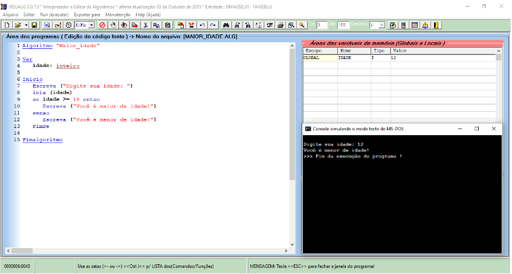
  
  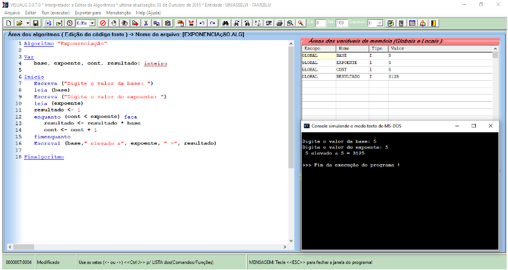
  
---

### 2. Projeto da disciplina Desenvolvimento em JavaScript
**Descrição:** Criação de um formulário no HTML e validação de campo de e-mail com JavaScript
e utilização da plataforma online Playcode para realização de testes e rotinas.

- **Tecnologias:** JavaScript, HTML
- **Palavras-chave:** javascript, formulários, html, validação de dados, playcode
- **Demonstração:** 

  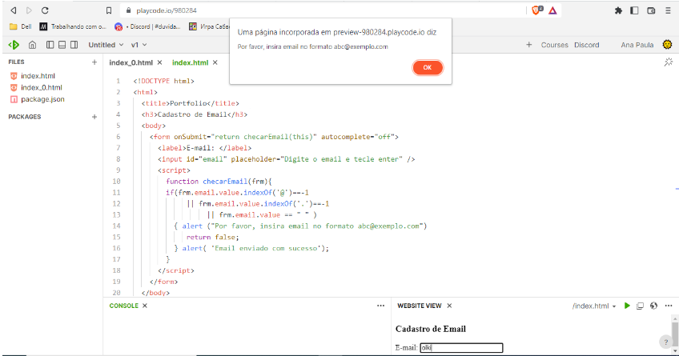
  
---

### 3. Projeto da disciplina Modelagem de Dados
**Descrição:** Implementação de uma base de dados utilizando o MySQL Workbench para o gerenciamento
  de um sistema de empréstimo de uma biblioteca universitária com criação de entidades, atributos,
  chaves primárias e estrangeiras e relacionamentos, tipos de dados e modelagem do DER.

- **Tecnologias:** MySQL, SGBD Workbench
- **Palavras-chave:** MySQL, workbench, dados, modelagem de dados, DER, diagrama, SGBD
- **Demonstração:**

  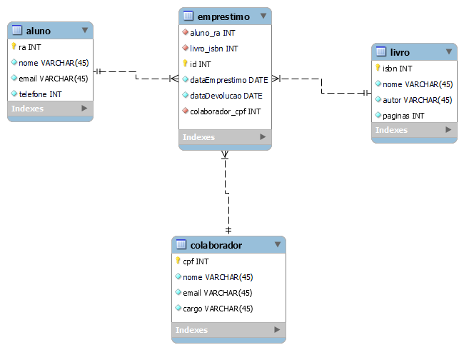
  
---

### 4. Projeto da disciplina Programação e Desenvolvimento de Banco de Dados
**Descrição:** Criação das tabelas que estruturam o banco de dados com a linguagem SQL por meio de
um diagrama entidade-relacionamento pré-definido, inserção de dados nas tabelas e criação de uma visão 
(view) para consulta dos dados.

- **Tecnologias:** MySQL, SGBD Workbench, linguagem SQL
- **Palavras-chave:** MySQL, workbench, banco de dados, DER, SGBD
- **Demonstração:**
  
  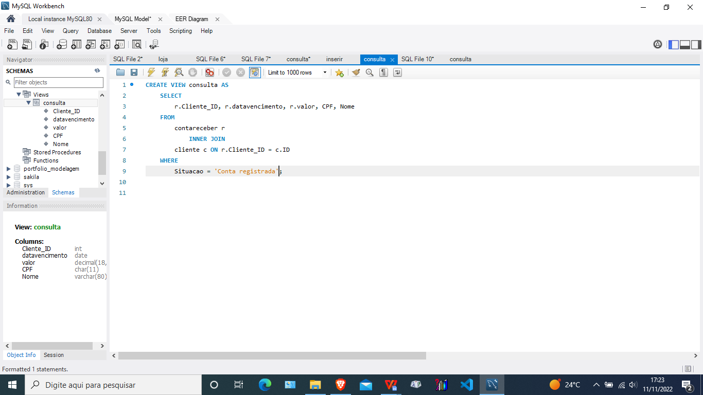
  
---

### 5. Projeto da disciplina Sistemas Operacionais
**Descrição:** Criação de máquina virtual Ubuntu com o software VirtualBox, realização de testes com
comandos Linux com sistema operacional GNU/Linux Ubuntu e criação estrutura de diretórios/pastas.

- **Tecnologias:** Linux, VirtualBox, Ubuntu
- **Palavras-chave:** Linux, virtualbox, ubuntu, open source
- **Demonstração:**

  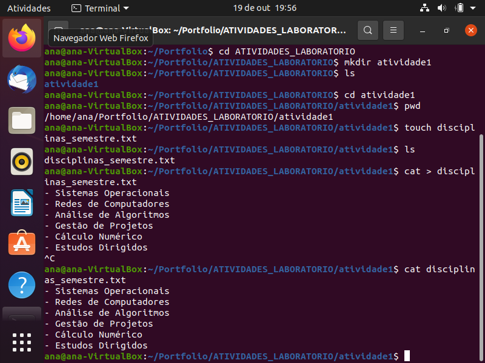
  
--- 

### 6. Projeto da disciplina Algoritmos e Estrutura de Dados
**Descrição:** Desenvolvimento de uma interface texto utilizando um algoritmo, calculando a diferença
de gols e informando ao usuário uma mensagem sobre os resultados

- **Tecnologias:** VisualG, portugol
- **Palavras-chave:** algoritmo, portugol, visualg, estrutura de dados, laços de repetição
- **Demonstração:**

  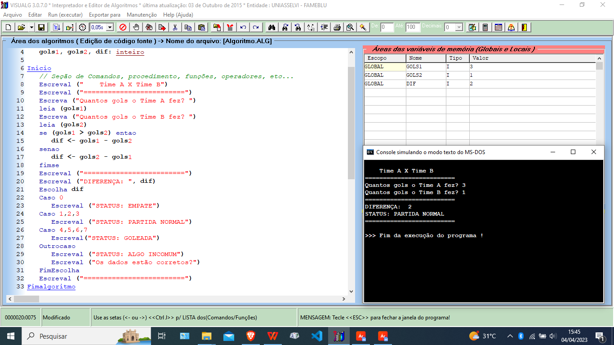

---

### 7. Projeto da disciplina Análise e Modelagem de Sistemas
**Descrição:** Desenvolvimento de um diagrama de casos de uso utilizando conhecimentos e práticas da UML
com o auxílio da versão online do Visual Paradigm

- **Tecnologias:** Visual Paradigm, UML
- **Palavras-chave:** casos de uso, UML, Visual Paradigm, modelagem de sistemas
- **Demonstração:**

  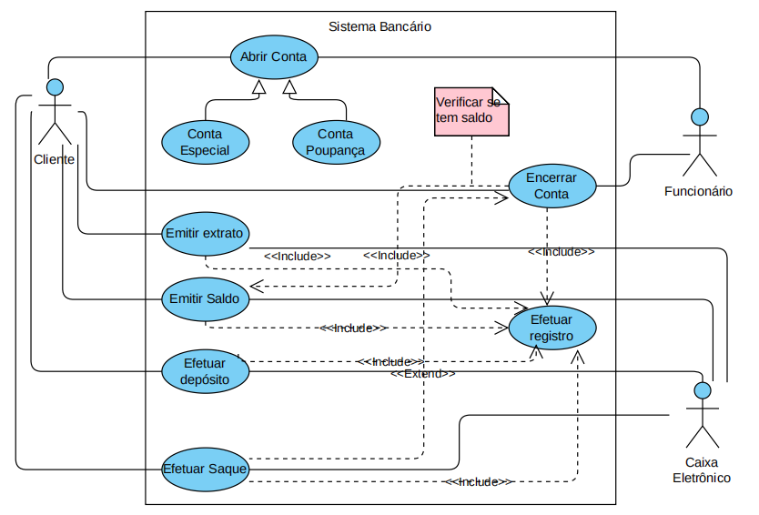

---  

### 8. Projeto da disciplina Programação para Internet em Back-End
**Descrição:** Criação de uma pequena aplicação com um formulário para cadastro de nome, e-mail e senha 
do usuário utilizando a linguagem PHP para gravação, conexão e cadastro no banco de dados MySQL utilizando
o XAMPP como servidor.

- **Tecnologias:** XAMPP, MySQL, linguagem PHP
- **Palavras-chave:** backend, banco de dados, mysql, xampp, apache, php
- **Demonstração:**

  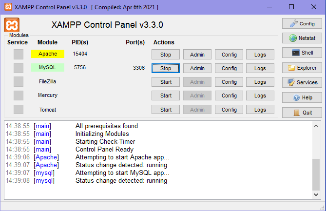

  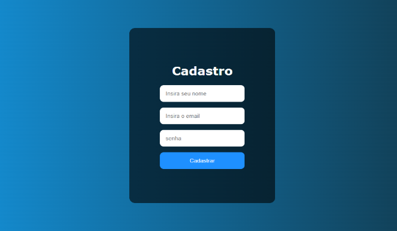

  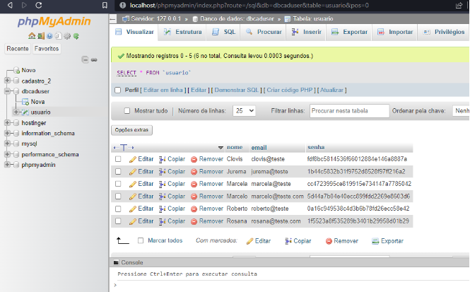

---

### Contato
- **E-mail:** [coiadoalmeida@gmail.com](mailto:coiadoalmeida@gmail.com)
- **Linkedin:** [https://www.linkedin.com/in/ana-paula-de-almeida-coiado/](https://www.linkedin.com/in/ana-paula-de-almeida-coiado/)
